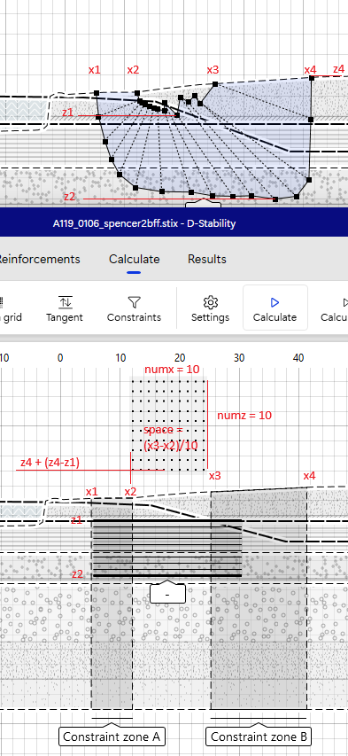
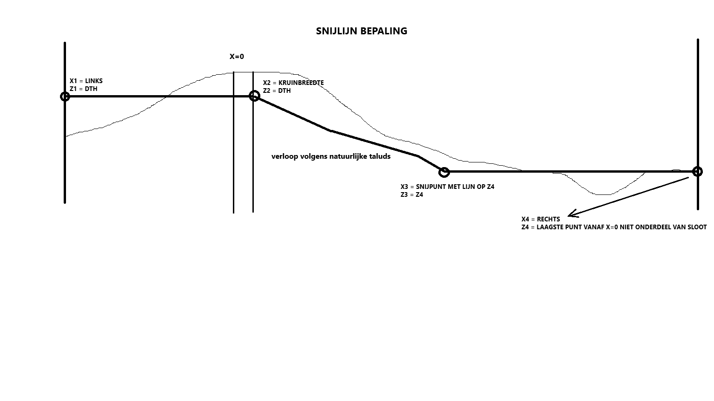
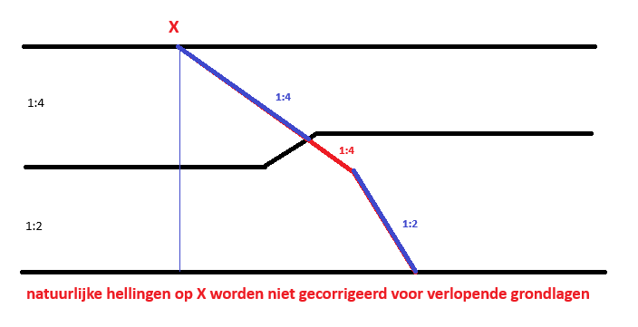
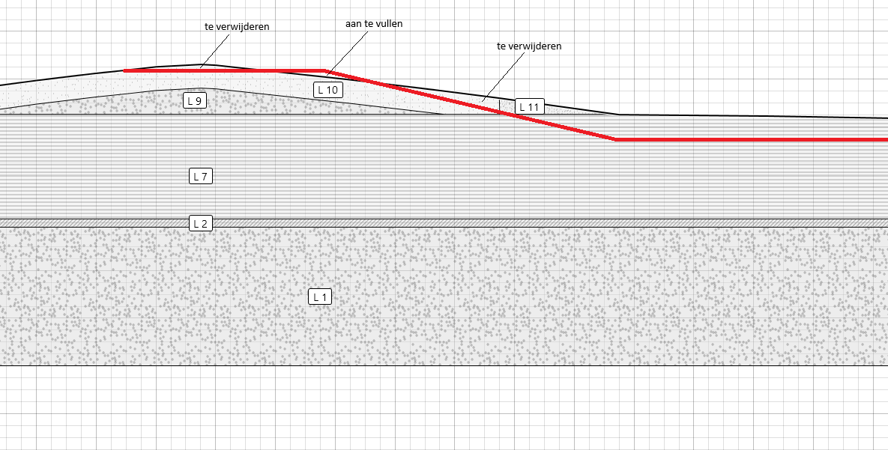
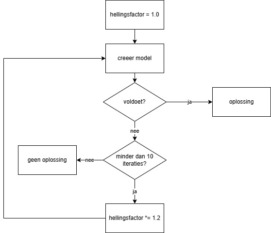

# Leggerprofielen scripts voor Waternet

## Doel

Deze code genereert leggerprofielen op basis van bestaande stix bestanden. In dit proces wordt gekeken naar het minimaal benodigde profiel om te voldoen aan de gestelde veiligheidseis. 

## Werkwijze

### Ophalen bestaande berekening en bijbehorende uitgangspunten

De bestaande berekening wordt ingelezen en de bijbehorende uitgangspunten worden opgehaald. Hiervoor is het van belang dat de berekeningen een naam hebben als ```<DIJKTRAJECT>_<METRERING>.stix```, bv ```A117_0200```. Op basis van de naam worden voor het dijktraject en de metrering de volgende uitgangspunten opgehaald;

* maatgevend hoogwater
* dijktafelhoogte
* onderhoudsdiepte
* IPO klasse

De IPO klasse bepaalt weer de vereiste veiligheidsfactor volgens de omzetting die in ```settings.py``` te vinden is;

```python
IPO_DICT = {
    "I": 0.90,
    "II": 0.90,
    "III": 0.90,
    "IV": 0.95,
    "V": 1.0,
}
```

In ```settings.py``` dienen de volgende constanten te worden opgegeven;

* CREST_WIDTH - de minimale kruinbreedt
* PL_SURFACE_OFFSET - de minimale afstand tussen het maaiveld en de freatische lijn
* TRAFFIC_LOAD_WIDTH - de breedte van de verkeersbelasting
* TRAFFIC_LOAD_MAGNITUDE - de magnitude van de verkeersbelasting
* SCHEMATISERINGSFACTOR - de aan te houden schematiseringsfactor

Op basis van het type berekening (LiftVan, Bishop of Spencer) wordt de modelfactor bepaald via de in de settings.py te vinden constante;

```
MODELFACTOR = {
    AnalysisTypeEnum.BISHOP_BRUTE_FORCE: 1.0,
    AnalysisTypeEnum.SPENCER_GENETIC: 0.95,
    AnalysisTypeEnum.UPLIFT_VAN_PARTICLE_SWARM: 1.05,
}
```

**LET OP** Omdat Spencer glijvlakken niet makkelijk te automatiseren zijn worden deze in script 2 omgezet naar Bishop berekeningen. Hierbij wordt een proces doorlopen dat de invoer van Spencer naar Bishop als volgt vertaalt;'



### Snijlijn bepaling

De snijlijn met de originele berekening wordt bepaald aan de hand van het minimale profiel;



**TIP** De toegepaste snijlijn kan altijd teruggevonden worden in de debug bestanden onder de naam ```<STAGE>__<DIJKTRAJECT>_<METRERING>.profile_line_<HELLINGSFACTOR>.png``` 

**LET OP** De natuurlijke hellingen worden bepaald door de grondsoorten direct onder coordinaat die opgegeven is als startpunt en worder **niet** gecorrigeerd als de grondsoorten verlopen, de volgende figuur maakt dit duidelijk;



Het toepassen van de snijlijn over de geometrie kan leiden tot plekken waar het bestaande profiel boven en onder de snijlijn ligt. Indien het profiel onder de snijlijn ligt moet deze worden aangevuld met een ophoogmateriaal. Deze is in ```settings.py``` gedefinieerd als 

```
# ophoogmateriaal eigenschappen
OPH_YD = 17.0  # droog vm
OPH_YS = 17.0  # nat vm
OPH_C = 1.5  # cohesie
OPH_PHI = 22.5  # phi
OPH_SLOPE = 3  # helling van het ophoogmateriaal
```

Indien het profiel boven de snijlijn ligt dan moet het worden verwijderd.

Hierbij een voorbeeld van hoe dit er uit kan zien;



Dit wordt in het script uitgevoerd door te verwijderen grond te voorzien van een zogenaamde excavation en aan te vullen grond aan het model toe te voegen als een nieuwe grondlaag met als grondsoort `ophoogmateriaal`.

**LET OP** Door een bug in geolib kan dit mis gaan, om dit te ondervangen dient de gebruikte geolib versie aan de hand van [deze code](https://gist.github.com/breinbaas/881d836d9d691768dd232ee31c76b9a5) te worden aangepast. 

### Oplossing vinden

Na het toepassen van de eerste snijlijn op basis van het minimale profiel dat gebaseerd is op een dijktafelhoogte, standaard kruinbreedte en de natuurlijke hellingen, wordt gekeken of de vereiste veiligheid gehaald wordt. Indien dit het geval is dan is deze berekening de oplossing (ook als de veiligheidsfactor (veel) groter is dan de vereiste veilgiheidsfactor). 

Indien de veiligheidsfactor niet voldoet wordt een hellingsfactor aan de natuurlijke hellingsberekening toegevoegd. Dit verloopt als volgt;



**TIP** Er zijn andere mogelijkheden om geautomatiseerd tot oplossingen te komen zoals een laag met een bepaalde breedte en dikte aanbrengen over het binnentalud. Dit kan als alternatief uitgewerkt worden.

Indien na 10 iteraties nog geen oplossing gevonden wordt is de berekening niet geautomatiseerd op te lossen en wordt deze naar de output/errors map verplaatst.

**LET OP** Het kan voorkomen dat er ongeldige geometrieen worden gemaakt. Dit kan bv gebeuren als de geometrie in de originele berekening aan de rechterzijde te krap gekozen is. Daarnaast zijn er onvoorziene geometrische complexe situaties mogelijk waardoor het script tot fouten leidt. In dit geval worden er 10 berekeningen gepoogd te maken en indien dit niet tot een oplossing leidt moet gekeken worden naar de debug bestanden om te zien waar het probleem zit.

### Uitwerking tot plot en csv bestand

Op basis van het rapport voor de bepaling van de leggerprofielen worden de volgende punten bepaald; 


## Invoer

### Uitgangspunten

De uitgangspunten staan onder de input map met daarin de volgende structuur en verplichte bestanden;

#### input/csv

dth.csv - een csv bestand met de dijktafelhoogte in de vorm van ```code,van,tot,mhw,mhw_2024,dth_2024``` bv ```A119,0,1615.74,0,0,0.1```
ipo.csv - een csv bestand met de IPO klasses in de vorm van ```TRAJECT,VAN,TOT,IPO_KLASSE``` bv ```A117,0,1030,V``` (Romeinse cijfers als kadeklasse gebruiken)
onderhoudsdiepte.csv - een csv bestand met de onderhoudsdiepte in de vorm van ```dijktraject,van,tot,onderhoudsdiepte```, bv ```A117,0.0,1030.0,-1.20```

**TODO** Dit moet via ArcGIS API calls geregeld worden

#### input/stix

In deze map staan een aantal submappen;

* input/stix/original - in deze map kunnen alle beschikbare stix bestanden geplaatst worden
* input/stix/all/bbf - deze map wordt door script 1 gevuld vanuit de bestanden in input/stix/original die bishop brute force berekeningen zijn
* input/stix/all/invalid - deze map wordt door script 1 gevuld vanuit de bestanden in input/stix/original die niet onder de andere 3 berekeningsmethodes vallen, deze moeten naar een van de geldige methodes geconverteerd worden. Pas dit aan in de input/stix/original map
* input/stix/all/liftvan - deze map wordt door script 1 gevuld vanuit de bestanden in input/stix/original die liftvan berekeningen zijn
* input/stix/all/spencer - deze map wordt door script 1 gevuld vanuit de bestanden in input/stix/original die spencer genetic algorithm berekeningen zijn

**TODO** Dit moet via Sharepoint gelezen en geschreven worden

## Scripts

### Script 1 - Schoonmaken van de mappenstructuur

Het script ```01 reset.py``` zorgt ervoor dat de beschikbare berekeningen in de juiste mappen worden geplaatst. Tevens worden de uitvoer mappen leeg gemaakt voor een nieuwe run.

### Script 2 - Omzetten Spencer berekeningen

Het script ```02 spencer_to_bbf.py``` vertaalt alle Spencer berekeningen naar bishop brute force berekeningen. De Spencer glijvlakken zijn slecht te automatiseren.

### Script 3 - Leggerprofiel bepaling

Het script ```03 main.py``` creeert voor elke bestaande berekening de leggerprofielen inclusief alle uitvoer voor eventuele debugging

## Uitvoer

### Resultaten

De resultaten worden als volgt opgeslagen;

* output/csv - csv bestanden van de leggerprofielen
* output/plots - plotjes van de gevonden profielen 
* output/stix - stix bestanden van de gevonden profielen
* output/errors - stix bestanden die fout gaan (bekijk in dit geval ook de bestanden in de output/debug directory)
* output/debug - alle bestanden die gegenereerd worden in het proces om eventueel na te gaan waarom een berekening niet doorloopt

### Debugging informatie

Voor elke berekening wordt een debug map aangemaakt. In deze map zijn de volgende bestanden te vinden;

* *.log - het log bestand met daarin een verslag van de ondernomen acties en eventuele waarschuwingen en meldingen
* *.png - de lijn die gebruikt is om het profiel af te snijden / aan te vullen obv de aangenomen hellingsfactor
* *.stix - de gegenereerde stix bestanden per stap
* *.csv - het eventueel gegenereerde csv bestand (identiek aan die in output/csv)

Deze bestanden kunnen gebruikt worden om te bepalen wat er in een berekening gebeurd is en wat oplossingen zouden kunnen zijn voor eventuele berekeningen die niet doorlopen.


